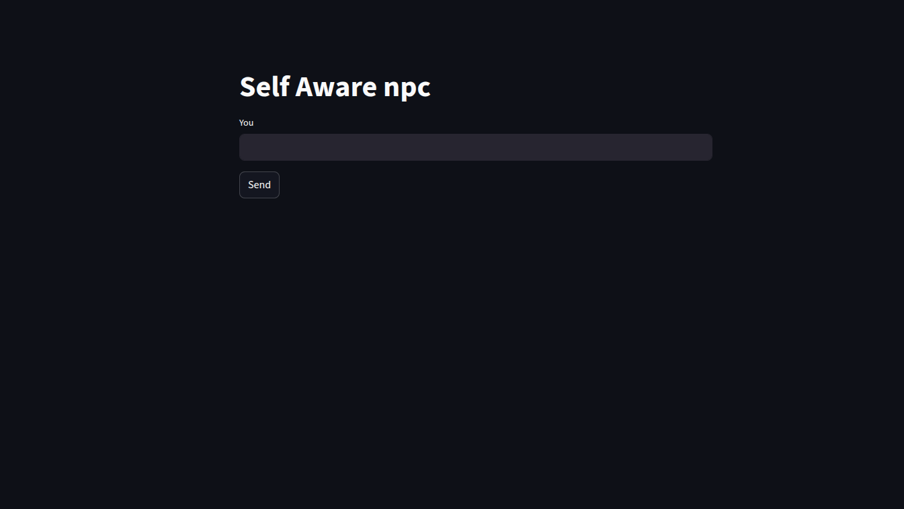

# Personality-Driven NPC with LLM (Ollama + Llama 3.1 + Streamlit)

## What This Project Is About

This is my 2nd Project in "15 projects to master Conversational AI" series
This project is a simple but fun experiment: building an **NPC that talks like it has a personality**.
Instead of generic chatbot answers, the NPC stays in-character. You could provide any personality you would like and it would answer in that way.

It’s powered by **Ollama** running **Llama 3.1 locally**, so no cloud APIs or internet required.

We’ve also added a Streamlit GUI so you can chat with your NPC in a simple, game-like interface.

---

## What It Can Do

- Lock an NPC into a personality and keep responses consistent.
- Respond in a roleplay-friendly way (not just Q\&A).
- Run fully offline using Ollama.
- Built with just **Python + requests + Streamlit** — lightweight and easy to extend.

---

## How It Works

1. Player input goes through a Streamlit UI.
2. Python sends it to the Ollama API.
3. A prompt template makes sure the NPC replies in-character.
4. The dialogue history is saved in session state, so conversations feel continuous.

It’s not fancy AI agent stuff, just some zero-shot prompting plus a lightweight UI. But it works.

---

## 🛠️ Tech Stack

- **Python 3.10+**
- **Streamlit** (for a simple UI)
- **Requests** (to talk to Ollama’s API)
- **Ollama + Llama 3.1** (local LLM inference)

---

## 🚀 How To Run

<!--
- You can just use the link below for testing it out first before running this locally
  Link : https://personality-npc.streamlit.app/ -->

1. Install [Ollama](https://ollama.ai).
2. Pull the model:

   ```bash
   ollama pull llama3.1
   ```

3. Install dependencies:

   ```bash
   pip install streamlit requests json
   ```

4. Run the app:

   ```bash
   streamlit run app.py
   ```

Type something into the chatbox and the NPC will respond in character.

- This is how the ui looks like:
  

## How i tested it out

- I wanted to make it interesting, so i just made the npc "self aware".
- The conversations that take place is good, and this model really achieves the simple purpose of adding a personality to NPC
- But the NPC still doesnt have any kind of memory. It could ramble on and on, but wouldnt remember the previous convo that we had

## What I Learned

- I have learned the basics of prompt engineering and what zero-shot prompting
- My earlier project didnt have any ui, so i wanted to integrate gui in this.Streamlit makes it dead simple to throw together a prototype UI.
- Running models locally with Ollama makes is much easier than using an external API, but the laptop needs to support the model as well.
- For me, my specs could cover a model upto 10B parameters smoothly without any problem
- So i choosed llama 3.1 8b for it.
- Eventhough NPC have a personality, it still lacks in any kind of memory. It could ramble on and on, but wouldnt remember the previous convo that we had

---

## The Next Step

- The next crucial step is creating my 3rd NPC project
- This time the NPC would remember past interactions using a short term and long term memory
- I think on using SQlite DB or pinecone for it

---
